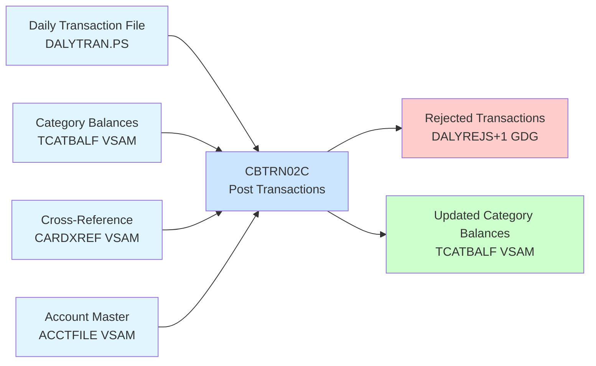
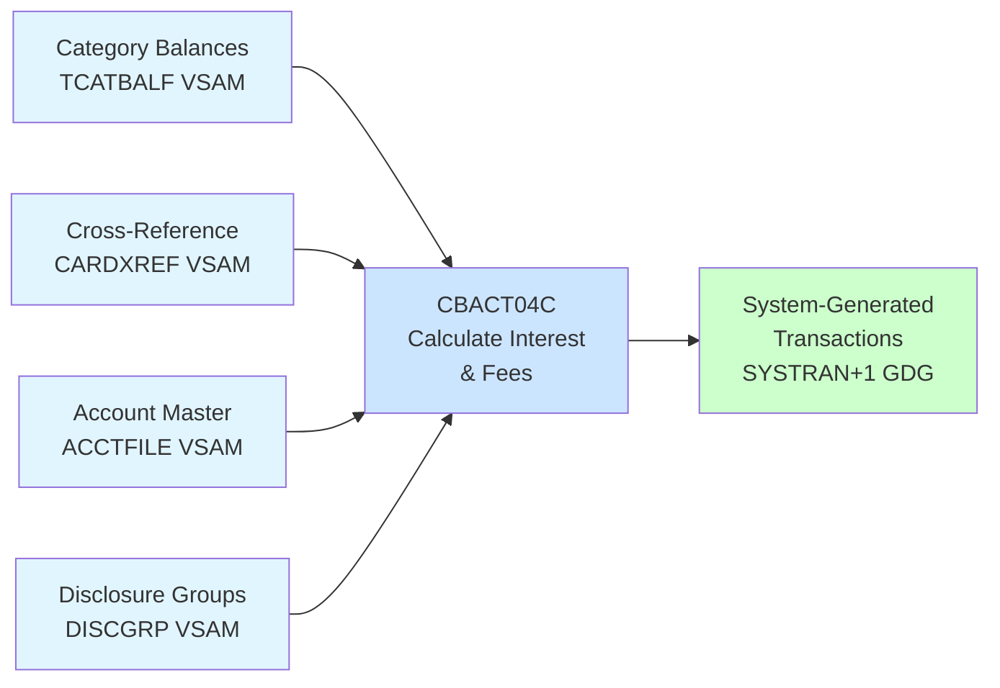
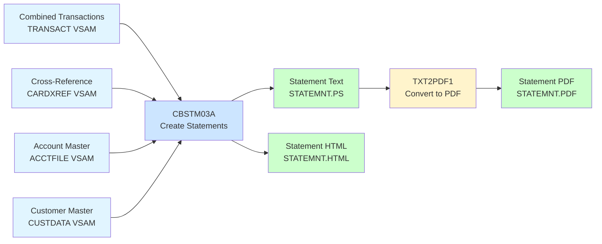

# Daily Batch Workflow Diagram

## Complete Daily Batch Processing Sequence

```mermaid
graph TD
    START([BATCH CYCLE START])
    
    START --> CLOSEFIL["CLOSEFIL<br/>Close CICS Files<br/>(SDSF)"]
    
    CLOSEFIL --> POSTTRAN["POSTTRAN<br/>Process Daily Transactions<br/>CBTRN02C<br/>Inputs: DALYTRAN, TRANSACT, XREF,<br/>ACCTFILE, TCATBALF<br/>Outputs: DALYREJS+1"]
    
    POSTTRAN --> INTCALC["INTCALC<br/>Calculate Interest/Fees<br/>CBACT04C<br/>Inputs: TCATBALF, XREF,<br/>ACCTFILE, DISCGRP<br/>Outputs: SYSTRAN+1"]
    
    INTCALC --> COMBTRAN["COMBTRAN<br/>Combine Current + System Trans<br/>SORT + IDCAMS REPRO<br/>Inputs: TRANSACT.BKUP, SYSTRAN<br/>Outputs: TRANSACT.COMBINED+1<br/>Reloads: TRANSACT VSAM"]
    
    COMBTRAN --> CREASTMT["CREASTMT<br/>Create Account Statements<br/>CBSTM03A<br/>Inputs: TRANSACT, XREF,<br/>ACCTFILE, CUSTFILE<br/>Outputs: STATEMNT.PS, STATEMNT.HTML"]
    
    CREASTMT --> TRANREPT["TRANREPT<br/>Generate Transaction Report<br/>CBTRN03C<br/>Inputs: TRANSACT, CARDXREF,<br/>TRANTYPE, TRANCATG<br/>Outputs: TRANSACT.DALY+1, TRANREPT+1"]
    
    TRANREPT --> PRTCATBL["PRTCATBL<br/>Print Category Balances<br/>SORT<br/>Inputs: TCATBALF<br/>Outputs: TCATBALF.REPT"]
    
    PRTCATBL --> TXT2PDF["TXT2PDF1<br/>Convert to PDF<br/>REXX TXT2PDF<br/>Inputs: STATEMNT.PS<br/>Outputs: STATEMNT.PDF"]
    
    TXT2PDF --> OPENFIL["OPENFIL<br/>Open CICS Files<br/>(SDSF)"]
    
    OPENFIL --> END([BATCH CYCLE COMPLETE])
    
    style CLOSEFIL fill:#ffcccc
    style OPENFIL fill:#ccffcc
    style POSTTRAN fill:#cce5ff
    style INTCALC fill:#cce5ff
    style COMBTRAN fill:#cce5ff
    style CREASTMT fill:#fff4cc
    style TRANREPT fill:#fff4cc
    style PRTCATBL fill:#fff4cc
    style TXT2PDF fill:#fff4cc
```



## Processing Flow Detail

### Phase 1: Transaction Processing


### Phase 2: Interest Calculation


### Phase 3: Statement Generation


## File Dependency Matrix

| Phase | Reads | Reads (Ref) | Reads (History) | Writes | Status |
|-------|-------|-------------|-----------------|--------|--------|
| Transaction Processing | DALYTRAN.PS | XREF, ACCTFILE, TCATBALF | - | DALYREJS+1 | Daily |
| Interest Calculation | TCATBALF | XREF, ACCTFILE, DISCGRP | - | SYSTRAN+1 | Daily |
| Combine Transactions | TRANSACT.BKUP, SYSTRAN | - | - | TRANSACT (reload) | Daily |
| Statement Generation | TRANSACT | XREF, ACCTFILE, CUSTFILE | - | STATEMNT.PS, .HTML | Daily |
| Report Generation | TRANSACT | CARDXREF, TRANTYPE, TRANCATG | - | TRANREPT+1 | Daily |
| Category Report | TCATBALF | - | - | TCATBALF.REPT | Daily |

## GDG Versioning

```
TRANSACT.BKUP(0)       <- Yesterday's backup
TRANSACT.DALY(0)       <- Yesterday's report data
SYSTRAN(0)             <- Yesterday's system trans
DALYREJS(0)            <- Yesterday's rejections
TRANREPT(0)            <- Yesterday's report

Day N:
POSTTRAN               -> Updates TCATBALF, creates DALYREJS(+1)
INTCALC                -> Creates SYSTRAN(+1)
COMBTRAN               -> Creates TRANSACT.COMBINED(+1)
TRANREPT               -> Backups TRANSACT, creates TRANSACT.DALY(+1), TRANREPT(+1)
PRTCATBL               -> Backups TCATBALF, creates TCATBALF.REPT
CREASTMT               -> Outputs STATEMNT.PS, STATEMNT.HTML
TXT2PDF1               -> Outputs STATEMNT.PDF

Day N+1:
TRANSACT.BKUP(0) now points to Day N backup
SYSTRAN(0) now points to Day N system transactions
TRANSACT.DALY(0) now points to Day N report data
```

## Key Design Patterns

1. **CLOSE/OPEN CICS Files**: Critical for CICS consistency
   - CLOSEFIL: Close files before batch starts
   - OPENFIL: Reopen files after batch ends

2. **Backup Before Processing**: GDG versioning ensures history
   - TRANREPT backs up TRANSACT before reporting
   - PRTCATBL backs up TCATBALF before printing

3. **Sequential Dependencies**: Jobs must run in order
   - POSTTRAN must complete before INTCALC
   - INTCALC must complete before COMBTRAN
   - COMBTRAN must complete before CREASTMT

4. **Data Consolidation**: Multiple input sources merged
   - Current transactions (DALYTRAN) + System transactions (SYSTRAN) -> TRANSACT
   - TRANSACT + Reference data -> Statements

5. **Report Generation**: Parallel to statement processing
   - TRANREPT and PRTCATBL can run in parallel after COMBTRAN
   - PDF generation can run in parallel with other reports
