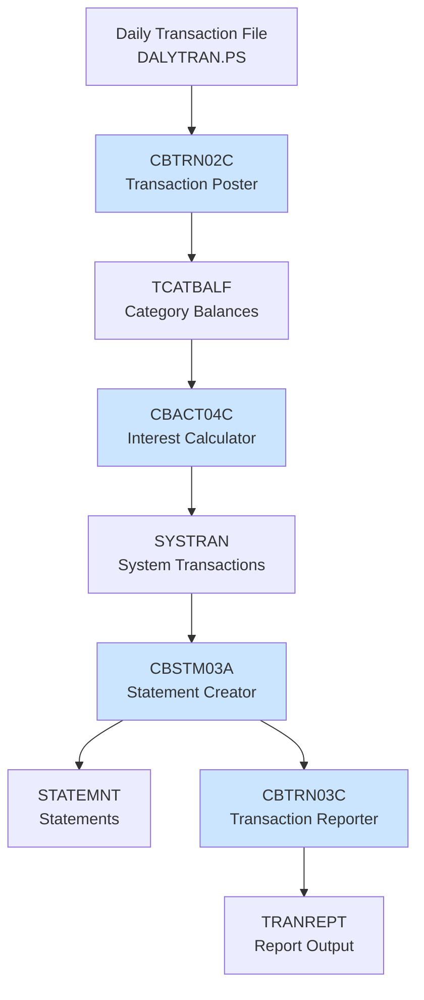
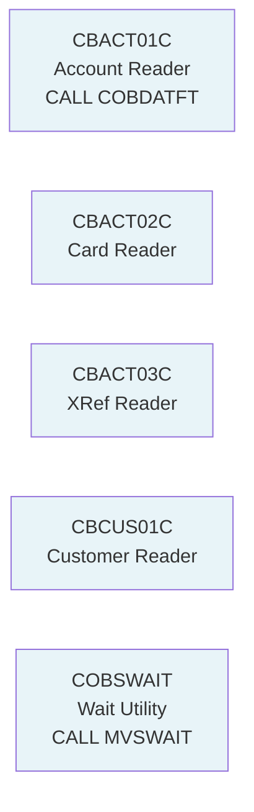
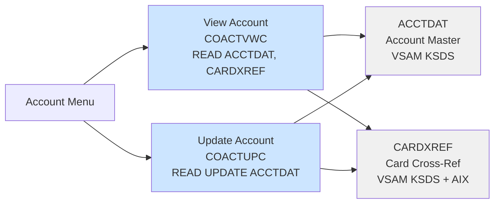
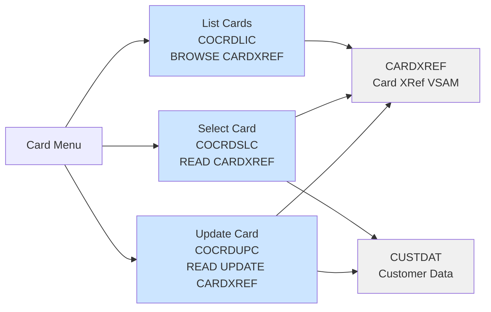
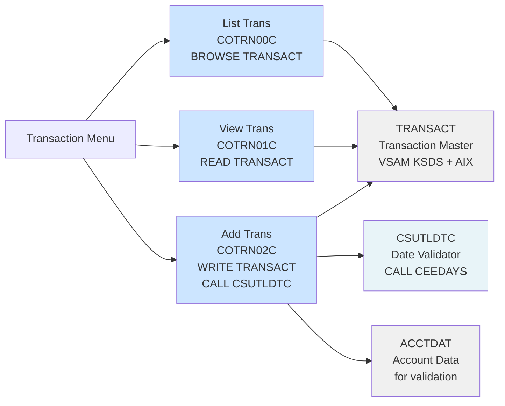
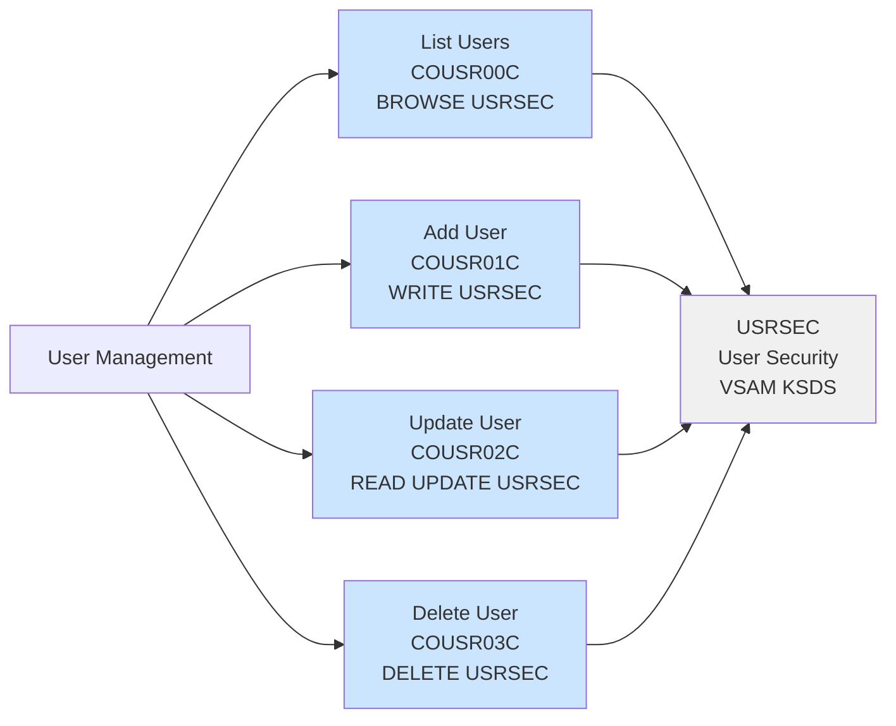
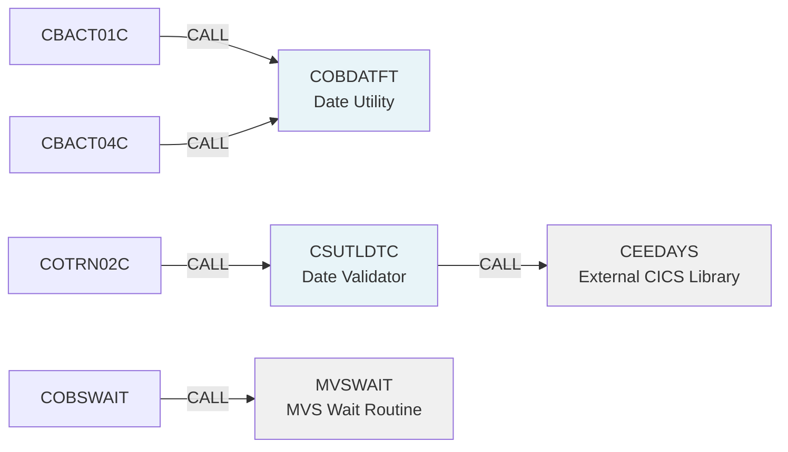
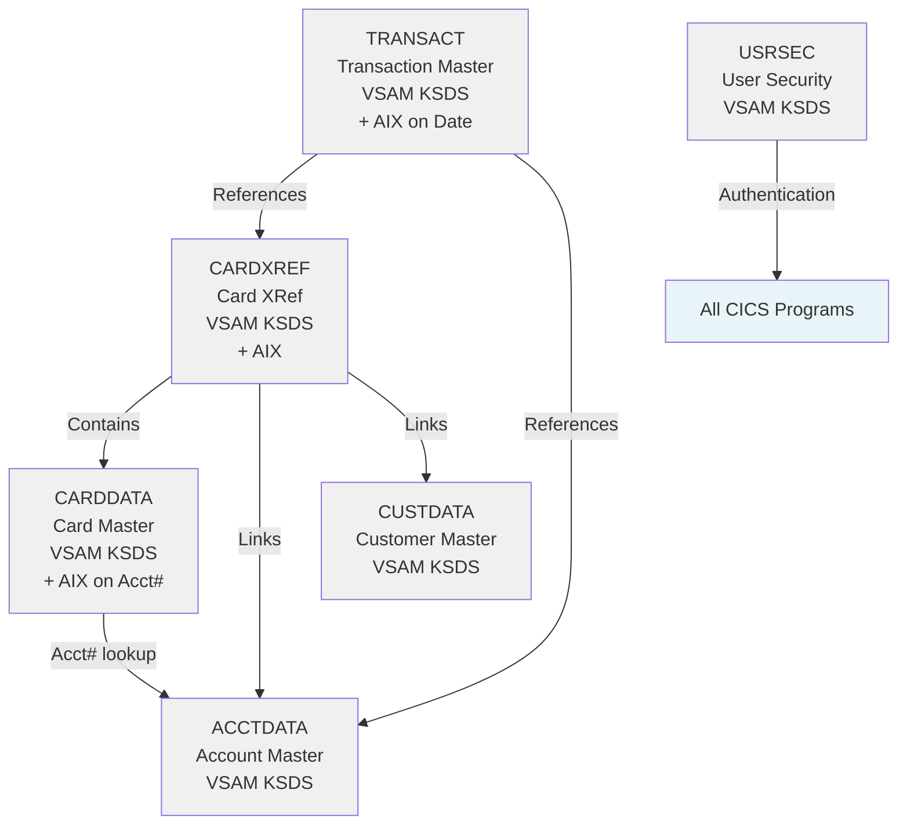

# Program Call Graph and Dependencies

## Batch Program Call Chain

## Batch Utility Programs

## CICS Entry Points and Navigation

```mermaid
graph TD
    COSGN00C["COSGN00C<br/>SIGNON<br/>Authenticates User"]
    
    COSGN00C -->|Admin User| COADM01C["COADM01C<br/>ADMIN MENU"]
    COSGN00C -->|Regular User| COMEN01C["COMEN01C<br/>USER MENU"]
    
    COADM01C -->|XCTL| COUSR00C["COUSR00C<br/>User List"]
    COADM01C -->|XCTL| COUSR01C["COUSR01C<br/>User Add"]
    COADM01C -->|XCTL| COUSR02C["COUSR02C<br/>User Update"]
    COADM01C -->|XCTL| COUSR03C["COUSR03C<br/>User Delete"]
    COADM01C -->|XCTL| CORPT00C["CORPT00C<br/>Report Submit"]
    
    COMEN01C -->|XCTL| COACTUPC["COACTUPC<br/>Account Update"]
    COMEN01C -->|XCTL| COACTVWC["COACTVWC<br/>Account View"]
    COMEN01C -->|XCTL| COCRDLIC["COCRDLIC<br/>Card List"]
    COMEN01C -->|XCTL| COCRDSLC["COCRDSLC<br/>Card Select"]
    COMEN01C -->|XCTL| COCRDUPC["COCRDUPC<br/>Card Update"]
    COMEN01C -->|XCTL| COTRN00C["COTRN00C<br/>Tran List"]
    COMEN01C -->|XCTL| COTRN01C["COTRN01C<br/>Tran View"]
    COMEN01C -->|XCTL| COTRN02C["COTRN02C<br/>Tran Add<br/>CALL CSUTLDTC"]
    COMEN01C -->|XCTL| COBIL00C["COBIL00C<br/>Bill Payment"]
    
    COUSR00C --> USRSEC["USRSEC<br/>User Security File"]
    COUSR01C --> USRSEC
    COUSR02C --> USRSEC
    COUSR03C --> USRSEC
    
    COACTUPC --> ACCTDAT["ACCTDAT<br/>Account Data"]
    COACTVWC --> ACCTDAT
    
    COCRDLIC --> CARDXREF["CARDXREF<br/>Card XRef"]
    COCRDSLC --> CARDXREF
    COCRDUPC --> CARDXREF
    
    COTRN00C --> TRANSACT["TRANSACT<br/>Transactions"]
    COTRN01C --> TRANSACT
    COTRN02C --> TRANSACT
    
    COBIL00C --> ACCTDAT
    CORPT00C --> JOBS["JOBS<br/>Transient Data Queue"]
    
    style COSGN00C fill:#ffcccc
    style COADM01C fill:#fff4cc
    style COMEN01C fill:#fff4cc
    style COUSR00C fill:#cce5ff
    style COUSR01C fill:#cce5ff
    style COUSR02C fill:#cce5ff
    style COUSR03C fill:#cce5ff
    style COACTUPC fill:#cce5ff
    style COACTVWC fill:#cce5ff
    style COCRDLIC fill:#cce5ff
    style COCRDSLC fill:#cce5ff
    style COCRDUPC fill:#cce5ff
    style COTRN00C fill:#cce5ff
    style COTRN01C fill:#cce5ff
    style COTRN02C fill:#cce5ff
    style COBIL00C fill:#cce5ff
    style CORPT00C fill:#cce5ff
    style USRSEC fill:#f0f0f0
    style ACCTDAT fill:#f0f0f0
    style CARDXREF fill:#f0f0f0
    style TRANSACT fill:#f0f0f0
    style JOBS fill:#f0f0f0
```

## Account Operations Subgraph

## Credit Card Operations Subgraph

## Transaction Operations Subgraph

## User Management Subgraph

## Direct CALL Dependencies

## Master File Relationships

## Copybook/Data Structure Dependencies

```mermaid
graph TD
    CVACT01Y["CVACT01Y<br/>Account Record<br/>Layout"]
    CVACT02Y["CVACT02Y<br/>Card Record<br/>Layout"]
    CVACT03Y["CVACT03Y<br/>XRef Record<br/>Layout"]
    CVTRA01Y["CVTRA01Y<br/>Category Balance<br/>Layout"]
    CVTRA02Y["CVTRA02Y<br/>Interest/Fee<br/>Layout"]
    CVTRA05Y["CVTRA05Y<br/>Transaction<br/>Record Layout"]
    CVTRA06Y["CVTRA06Y<br/>Daily Trans<br/>Input Layout"]
    CVCUS01Y["CVCUS01Y<br/>Customer<br/>Record Layout"]
    CSUSR01Y["CSUSR01Y<br/>User Security<br/>Record Layout"]
    
    CBACT01C["CBACT01C"] --> CVACT01Y
    CBACT02C["CBACT02C"] --> CVACT02Y
    CBACT03C["CBACT03C"] --> CVACT03Y
    CBACT04C["CBACT04C"] --> CVTRA01Y
    CBACT04C --> CVTRA02Y
    CBTRN01C["CBTRN01C"] --> CVTRA06Y
    CBTRN02C["CBTRN02C"] --> CVTRA06Y
    CBTRN03C["CBTRN03C"] --> CVTRA05Y
    
    CBSTM03A["CBSTM03A"] --> CVTRA05Y
    CBSTM03A --> CVACT01Y
    
    COACTUPC["COACTUPC"] --> CVACT01Y
    COUSR00C["COUSR00C"] --> CSUSR01Y
    COTRN02C["COTRN02C"] --> CVTRA05Y
    
    style CVACT01Y fill:#fff4cc
    style CVACT02Y fill:#fff4cc
    style CVACT03Y fill:#fff4cc
    style CVTRA01Y fill:#fff4cc
    style CVTRA02Y fill:#fff4cc
    style CVTRA05Y fill:#fff4cc
    style CVTRA06Y fill:#fff4cc
    style CVCUS01Y fill:#fff4cc
    style CSUSR01Y fill:#fff4cc
```

